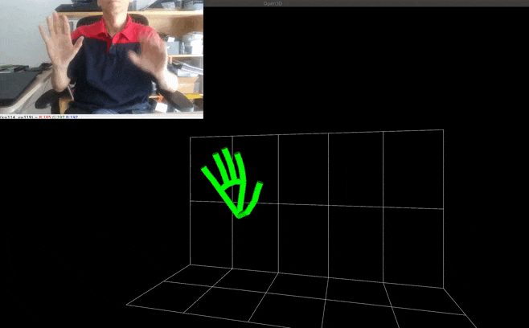

# 3D visualization and smoothing filter

This demo demonstrates the use of Open3d to visualize hands in pseudo-3D.
Here, pseudo-3D means that the 3d information is inferred by the landmark model from 2D images (for depth-capable devices, depth is not used).
For one hand, the z-component of its landmarks are relative to the wrist landmark. But we can't know the relative z positions of two wrist landmarks (from different hands).
Notice that in practice, wrist landmarks are all drawn on the same vertical plane. So if a hand seems closer than the other one, it is just because the former is drawn bigger !

Moreover, in solo mode (when we want to track only one hand at most), filtering is applied to the landmarks to reduce jittering.
To use solo mode: `./demo.py -s` or `./demo.py -e` (edge mode)

The color depends on the handedness (green for right hand, red for left hand and in between when uncertain).




## Usage

```
-> ./demo.py -h
usage: demo.py [-h] [-e] [-i INPUT] [--pd_model PD_MODEL]
               [--lm_model LM_MODEL] [-s] [--no_smoothing] [-f INTERNAL_FPS]
               [--internal_frame_height INTERNAL_FRAME_HEIGHT]

optional arguments:
  -h, --help            show this help message and exit
  -e, --edge            Use Edge mode (postprocessing runs on the device)

Tracker arguments:
  -i INPUT, --input INPUT
                        Path to video or image file to use as input (if not
                        specified, use OAK color camera)
  --pd_model PD_MODEL   Path to a blob file for palm detection model
  --lm_model LM_MODEL   Path to a blob file for landmark model
  -s, --solo            Detect one hand max
  --no_smoothing        Disable smoothing filter (smoothing works only in solo
                        mode)
  -f INTERNAL_FPS, --internal_fps INTERNAL_FPS
                        Fps of internal color camera. Too high value lower NN
                        fps (default= depends on the model)
  --internal_frame_height INTERNAL_FRAME_HEIGHT
                        Internal color camera frame height in pixels
```


|Keypress|Function|
|-|-|
|**In OpenCV window:**|
|*Esc* or q|Exit|
|*space*|Pause|
|s|Pause/unpause smoothing filter (if enabled at start)|
|**In Open3d window:**|
|Keypress|Function|
|-|-|
|o|Oscillating (rotating back and forth) of the view|
|r|Continuous rotating of the view|
|s|Stop oscillating or rotating|
|*Up*|Increasing rotating or oscillating speed|
|*Down*|Decreasing rotating or oscillating speed|
|*Right* or *Left*|Change the point of view to a predefined position|
|*Mouse*|Freely change the point of view|